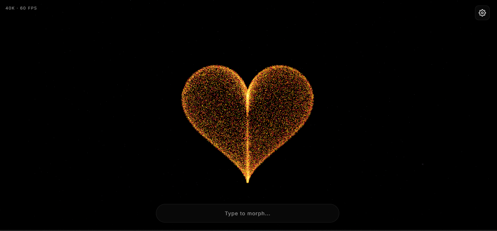

# 3D Particle System Pro

A high-performance, feature-rich 3D particle morphing system with audio visualization, physics simulation, and extensive customization options. Built with Three.js and optimized for OLED displays with true black backgrounds.



## ✨ Features

### 🎨 Visual Features
- **10 Shape Morphs**: Heart, Sphere, Torus, Galaxy, DNA, Cube, Wave, Star, Spiral
- **8 Color Themes**: Fire, Ocean, Aurora, Sunset, Cyber, Gold, Candy, Rainbow
- **Custom Color Mixer**: Create your own gradient palettes
- **3 Particle Types**: Dots, Lines, Triangles
- **OLED True Black**: Optimized for AMOLED screens with pure #000000 background
- **Particle Trails**: Leave glowing trails behind particles
- **Connection Lines**: Draw lines between nearby particles

### 🎵 Audio & Interaction
- **Audio Visualizer**: Real-time microphone input creates particle waves
- **Mouse Interaction**: Repel/attract particles with cursor
- **Magnetic Fields**: Create attractors/repulsors by clicking and dragging
- **Touch Support**: Full mobile and tablet support

### ⚙️ Physics & Animation
- **Gravity Physics**: Particles fall and bounce with realistic physics
- **Particle Life**: Particles age and fade with lifespan
- **Auto Rotation**: Smooth continuous rotation
- **Ripple Waves**: Wave distortion effects
- **Explode Action**: Blast all particles outward

### 💾 Data Management
- **Export/Import**: Save and load custom presets as JSON
- **Screenshots**: Capture and download current view as PNG
- **Randomizer**: Randomize all settings with one click
- **Presets**: Default, Neon, Calm, and Chaos built-in presets

### 📱 Responsive Design
- **All Devices**: Works on desktop, tablet, and mobile
- **Settings Panel**: Slide-out panel with all controls
- **Minimal UI**: Clean, distraction-free interface
- **Performance Stats**: Live FPS and particle count display

## 🚀 Getting Started

### Quick Start
1. Open `index.html` in any modern web browser
2. Type in the input field to morph text
3. Click the ⚙️ settings icon to access all features
4. Allow microphone access for audio visualization

### Controls

| Action | Control |
|--------|---------|
| Rotate | Click & Drag |
| Zoom | Mouse Wheel |
| Repel Particles | Move Mouse |
| Attract Particles | Click + Move |
| Settings | Top Right Gear Icon |

## 🎛️ Settings Panel

### Shapes
- ♥ Heart - Classic 3D heart shape
- ◉ Sphere - Perfect sphere distribution
- ◎ Torus - Donut/torus shape
- ✦ Galaxy - Spiral galaxy arms
- ⌇ DNA - Double helix structure
- ⬡ Cube - 6-sided cube surface
- 〜 Wave - Sine wave surface
- ★ Star - 5-pointed star
- ⊛ Spiral - 3D spiral/tornado

### Particle Type
- **Dots** - Standard particle points
- **Lines** - Line segment particles
- **Triangles** - Triangle primitive particles

### Color Themes
- **Fire** - Red, orange, yellow gradients
- **Ocean** - Blue, cyan, teal gradients
- **Aurora** - Green, purple, pink gradients
- **Sunset** - Orange, pink, purple gradients
- **Cyber** - Cyan, magenta, purple gradients
- **Gold** - Yellow, orange, gold gradients
- **Candy** - Pastel pink, blue, purple
- **Rainbow** - Full spectrum cycling

### Parameters
| Setting | Range | Description |
|---------|-------|-------------|
| Particle Size | 0.02 - 0.5 | Size of each particle |
| Speed | 0.1 - 3.0 | Animation speed multiplier |
| Spread | 0.5 - 2.0 | Scale of the shape |
| Mouse Force | 0 - 10 | Strength of mouse interaction |
| Gravity | -2.0 - 2.0 | Gravity force (negative = up) |
| Connections | 0 - 5 | Max connections per particle |
| Trail Length | 0 - 20 | Length of particle trails |

### Effects Toggles
- **Auto Rotate** - Continuous automatic rotation
- **Mouse Repel** - Particles flee from cursor
- **Ripple Wave** - Add wave distortion
- **Audio Visualizer** - React to microphone
- **Magnetic Fields** - Create magnetic attractors
- **Particle Life** - Particles age and respawn
- **Stars Background** - Show background starfield

### Actions
- **💥 Explode** - Blast particles outward
- **📸 Save** - Screenshot as PNG
- **🎲 Random** - Randomize all settings
- **📤 Export** - Save preset to JSON
- **📥 Import** - Load preset from JSON
- **↺ Reset** - Reset to defaults

## 🔧 Technical Details

### Performance
- **40,000 Particles** at 60 FPS
- **2,500 Background Stars**
- Optimized Float32Arrays for physics
- Efficient WebGL rendering
- RequestAnimationFrame loop

### Browser Support
- Chrome 80+
- Firefox 75+
- Safari 13+
- Edge 80+
- Mobile browsers (iOS Safari, Chrome Android)

### Requirements
- WebGL enabled
- Microphone (for audio visualizer)
- Modern JavaScript (ES6+)

## 📝 Customization

### Creating Custom Themes
Use the Color Mixer in settings to create custom palettes:
1. Click the "+" color dot
2. Adjust Primary, Secondary, and Accent colors
3. Particles will use your custom gradient

### Saving Presets
Export your configuration as JSON:
```json
{
  "config": {
    "particleCount": 40000,
    "currentShape": "galaxy",
    "currentTheme": "custom",
    "speed": 1.5,
    "gravity": 0.5
  },
  "text": "Hello",
  "customColors": ["#ff0040", "#ff8800", "#ffdd00"]
}
```

## 🐛 Troubleshooting

### Low FPS
- Reduce particle count (edit CONFIG.particleCount)
- Disable connections
- Lower trail length
- Close other browser tabs

### Audio Not Working
- Check microphone permissions
- Ensure HTTPS or localhost
- Try clicking the audio toggle again

### Mobile Issues
- Use landscape orientation
- Disable connections for better performance
- Ensure WebGL is enabled

## 🎯 Use Cases

- **Live Performances** - Audio-reactive visuals
- **Music Videos** - Synchronized particle effects
- **Interactive Art** - Museum installations
- **Streaming** - OBS browser source
- **Relaxation** - Calming visual meditation
- **Presentations** - Dynamic backgrounds

## 📄 License

MIT License - Free for personal and commercial use.

## 🙏 Credits

- Built with [Three.js](https://threejs.org/)
- Font: Inter by Google Fonts
- Icons: Custom SVG

## 🔮 Future Features

- [ ] VR/AR support
- [ ] Video export
- [ ] MIDI controller support
- [ ] OSC integration
- [ ] WebSocket multiplayer
- [ ] AI-generated shapes
- [ ] Particle collision
- [ ] Wind forces

---

**Enjoy the particles!** ✨

For issues and feature requests, please open an issue on GitHub.
